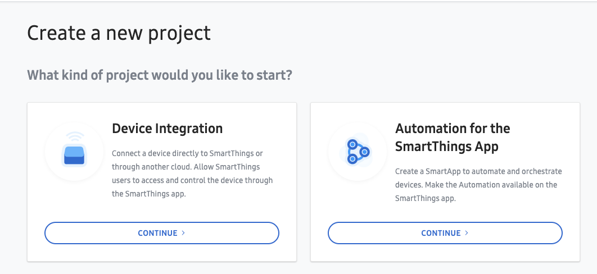
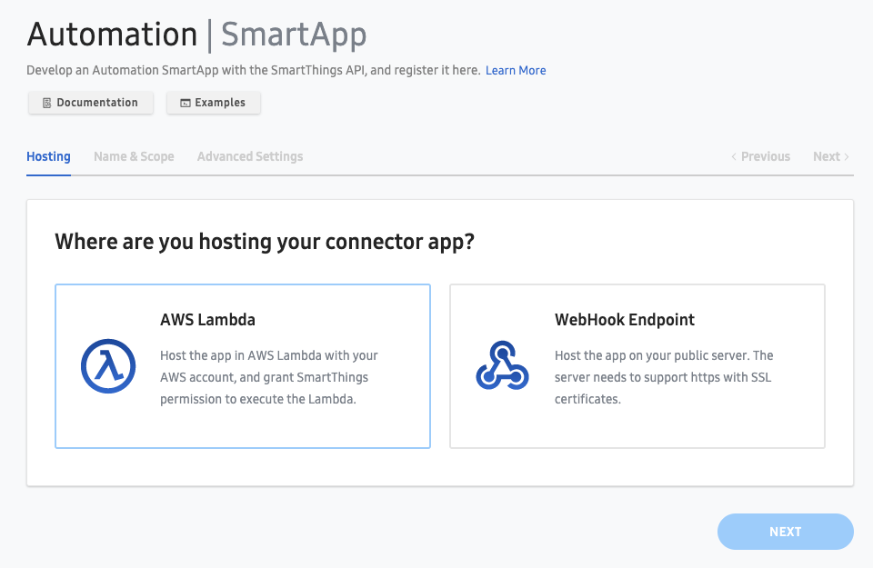

# Smartthings - Tado Integration

This integration provides basic geolocation synchronisation between the SmartThings Home Monitor (SHM) and Tado.

Upon installing this SmartApp, Tado will be set to Away mode when SHM is set to Away, and back to Home when SHM is Disarmed

This SmartApp authenticates with Tado using Oauth2 device flow. The authorize url to sign in at is sent via SMS using AWS SNS. I'd prefer to build it into the Smartthings SmartApp to do the auth flow directly in the app (with push notifications informing if the token expires) but couldn't get this working.

You need to ensure that you have AWS SNS setup with a registered Sender ID and approved phone number before the SMS will be successfully delivered.

## How to Deploy

### Prerequisites

- Install AWS CLI
- Install SmartThings CLI

1/ Create SmartApp in SmartThings Developer Console

Create a new project selecting the "Automation for the SmartThings App" type:


2/ Setup an AWS Account

https://aws.amazon.com/premiumsupport/knowledge-center/create-and-activate-aws-account/

3/ Clone this repo

4/ Install NPM dependencies

```
npm install
```

5/ Deploy with Serverless framework

Populate the below placeholders with your App ID, Yale Username and Password. Don't worry about the Client ID and Secret yet, they come later.

```
npx sls deploy \
 --param="appId=TEMPAPPID" \
 --param="clientId=TEMPCLIENTID" \
 --param="clientSecret=TEMPCLIENTSECRET" \
 --param="mobileNumber=+<YOUR_MOBILE_NUMBER>"
```

Grant SmartThings cloud permission to invoke your new Lambda
`aws lambda add-permission --function-name <name-of-your-lambda-function> --statement-id smartthings --principal 906037444270 --action lambda:InvokeFunction`

Get the AWS Resource Name of the newly created function

6/ Configure an AWS Lambda integration in your SmartApp

On the main page in the Developer Console, click the "Register App" button and select the AWS Lambda option


Keep a record of the App Id, Client Id and Client Secret generated when creating the project

7/ Update Lambda function with Client ID and Secret

```
./node_modules/.bin/sls deploy \
 --param="appId=<YOUR_APP_ID>" \
 --param="clientId=<YOUR_ST_CLIENT_ID>" \
 --param="clientSecret=<YOUR_ST_CLIENT_SECRET>" \
 --param="mobileNumber=+<YOUR_MOBILE_NUMBER>"
```

Download the OAuth configuration for your new app

`smartthings apps:oauth <YOUR_APP_ID> -j > appOauth.json`

Replace the scope you added previously with the following scope

`r:security:locations:*:armstate`

Save and re-publish the OAuth config:

`smartthings apps:oauth:generate <YOUR_APP_ID> -i appOauth.json`

8/ Install app from SmartThings App

All that's needed here is to press the "Done" button - in this first iteration all the required details are passed into the Lambda creation step.

On the first attempt to set the Smart Home Monitor to Away, the app will send an SMS to your mobile number with a link to the Tado authorisation page. Click the link and follow the instructions to authorise the app.

The lambda timeout is 60 seconds, which gives you a minute to receive the SMS, log in and authorise the app. If you don't complete the authorisation in time, you'll need to disarm and rearm the Smart Home Monitor to trigger the authentication flow again. Alternatively, you can increase the timeout in the serverless.yml file.

## TODO

- Basic unit tests
- Add SmartThings principal addition to Serverless deployment
